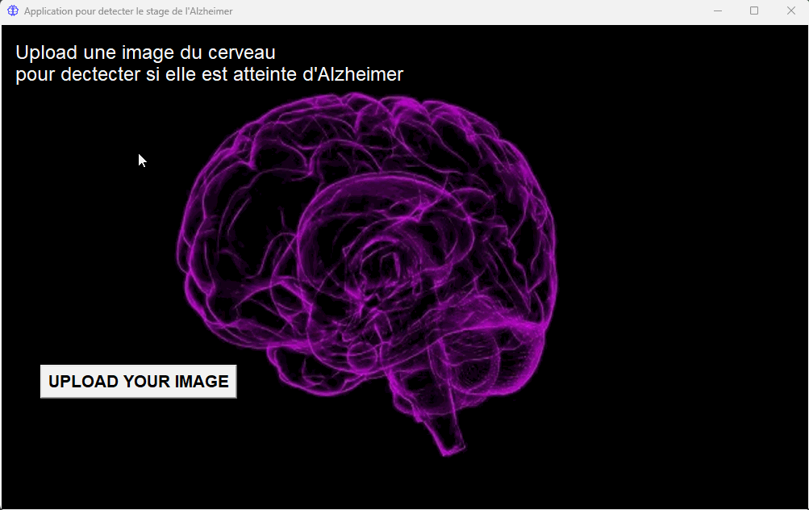

# Alzheimer-s_Detection
A desktop application with tkinter and include Machine Learning to detect what is the Alzheimer's stage of a brain image.

## User Stories
- [x] User can click on a button to go the computer drive.
- [x] Upload an image of the brain.
- [x] The image will be display on the screen with the stage of the Alzheimer.

## Video Walkthrough

Here's a walkthrough of implemented user stories:

GIF created with [LiceCap].

## Libraries used
- [Kaggle](https://www.kaggle.com/) -Dataset
- [Numpy](https://www.kaggle.com/) -Dataset
- [Seaborn](https://www.kaggle.com/) -Dataset
- [Matplotlib](https://www.kaggle.com/) -Dataset
- [Pandas](https://www.kaggle.com/) -Dataset
- [Tensorflow](https://www.kaggle.com/) -Dataset
